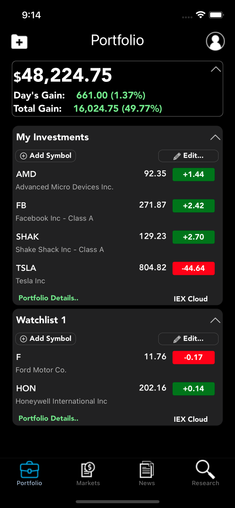
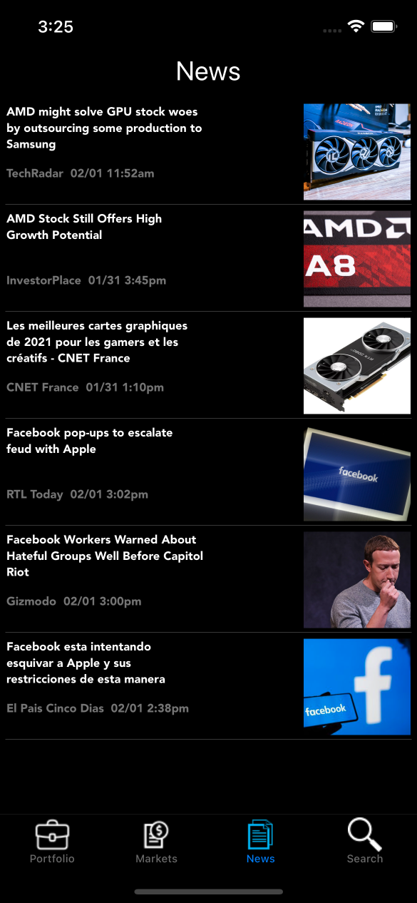

# TradeSim
TradeSim is a demo project that allows you to track your stock portfolio using real-time market data and news. <br />
Create Portfolios or Watchlists of your existing holdings that you can monitor to see how well your investments are doing.  <br />
The project was created using React Native, MobX, Firebase and iexCloud.io for Market Data. <br />

## Tech Stack
- [React Native](https://facebook.github.io/react-native/)
- [React Native Navigation](https://github.com/wix/react-native-navigation) 
- [MobX](http://mobx.js.org) - State Management
- [iexCloud] (https://iexcloud.io) - Powerful cloud-based market data and other financial tools

<br/>

## Setup for iOS

### Setup Firebase
Create a new firebase project [here](https://console.firebase.google.com/) and set up an iOS or Android project with a bundleID. Download the cooresponding `plist` or `json` files.  

Update the stores/SettingsStore.js file with your own firebase config data.

Copy `GoogleService-Info.plist` to overwrite the placeholder file in the `ios` folder.

Add the project name to `.firebaserc` on `line 3`. 

If you want to use the provided Firebase Cloud Function (./functions/onUserCreated)
You will need to set up firebase's CLI tools and deploy. For more info, go [here.](https://firebase.google.com/docs/functions/get-started)  
```bash
$ firebase deploy --only functions
```

Note: if you don't want to use the Firebase Cloud function:
- From the Firebase Console: enable Email/Password and (optionally) Goolgle Sign-in Providers (Authentication Tab->Sign-in)
- From the Firebase Console: register an email address (Authentication Tab->Users)
- Import the firebase/firebase-structure.json into your Firebase realtime-database root (update the Placeholder to your new User UID)

❉ __Install Node Packages__  
```bash
From inside of your app directory:
$ yarn
- or -
npm install
```

### Register at iexCloud - for real-time Market Data API keys (Sandbox and Production)
Start for free at iexCloud.io [here](https://iexCloud.io/)!
Add your iexCloud API keys to your 'user' hive in Firebase (please don't share your API keys!)  
"iexData" : {
        "iexDevURL" : "https://sandbox.iexapis.com",
        "iexProdURL" : "https://cloud.iexapis.com",
        "iexProduction" : "pk_xxxxxxxxxxxxxxxxx",
        "iexSandbox" : "Tsk_xxxxxxxxxxxxxxxx",
        "iexUseProduction" : false
      },


__Run React Native Simulator__  
```bash
$ react-native run-ios  
or  
$ react-native run-ios  
```

## Credits:
React-Native-mobx-firebase-starter (https://github.com/alexwasner/react-native-mobx-firebase-starter) - Credit to Alex Wasner for an excellent React Native, Firebase and MobX starter project!

<br />

<h1 align="center">
Sample TradeSim Screens
  <br>
  <br>
  <br>
  <br>
</h1>